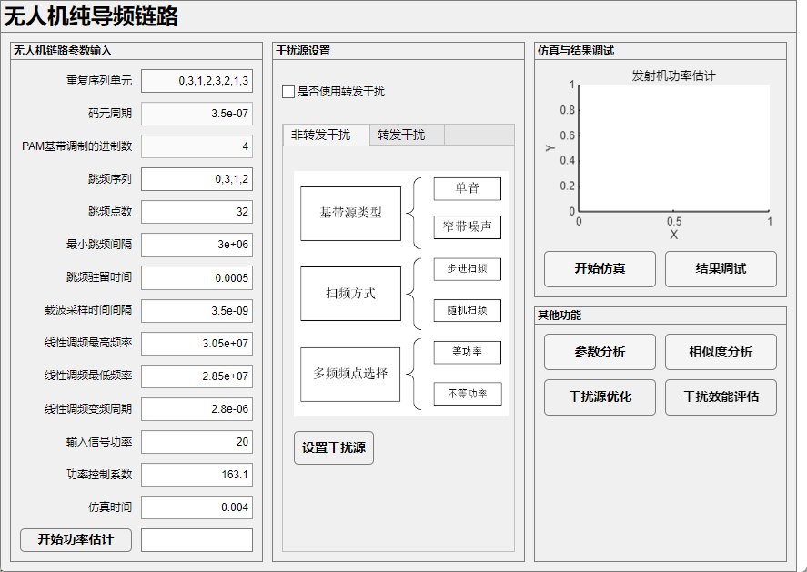
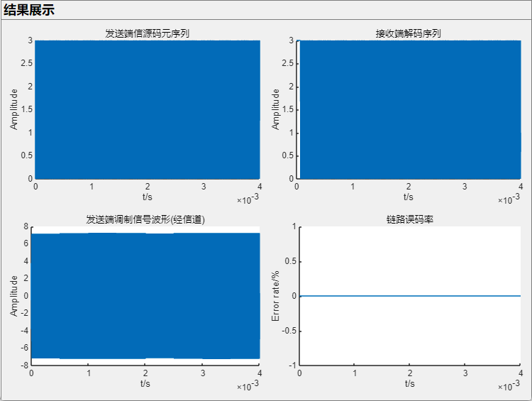
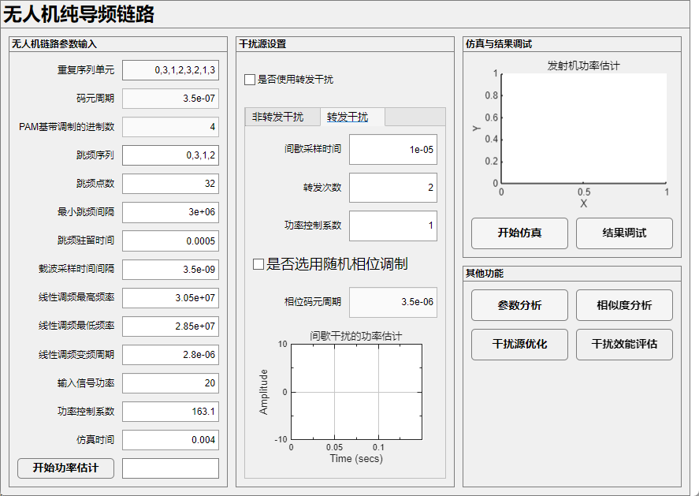
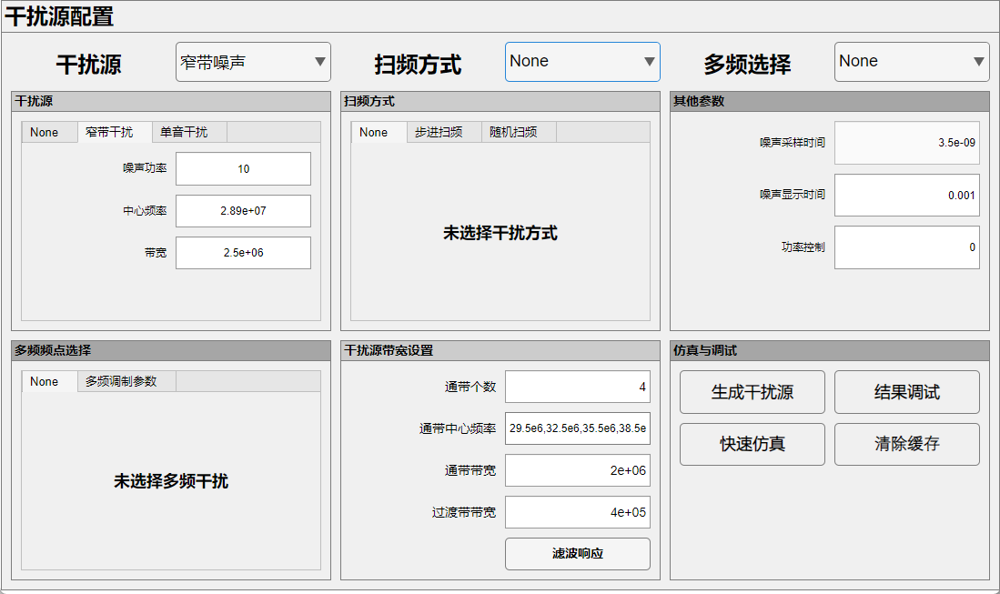
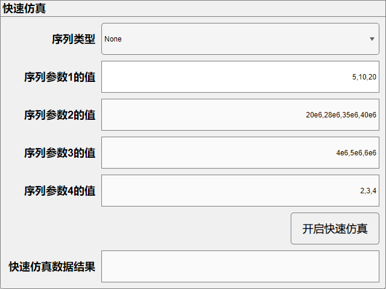
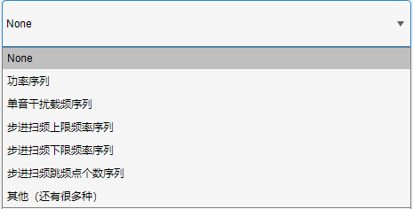
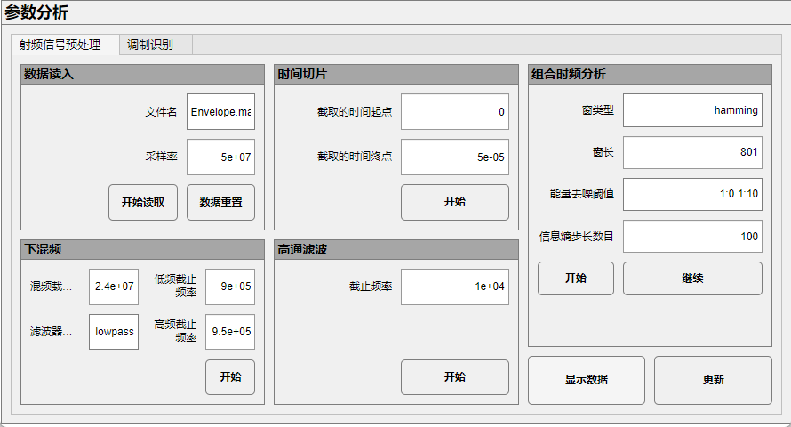
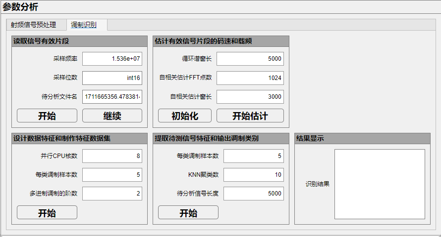
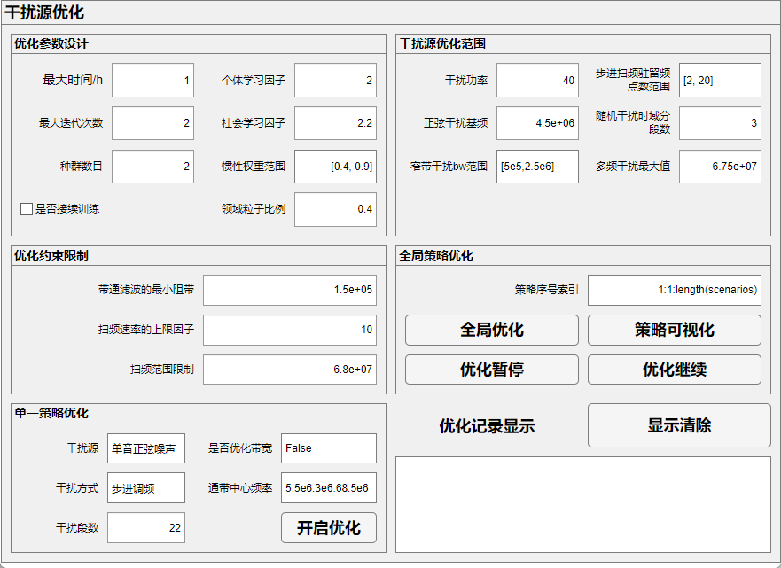
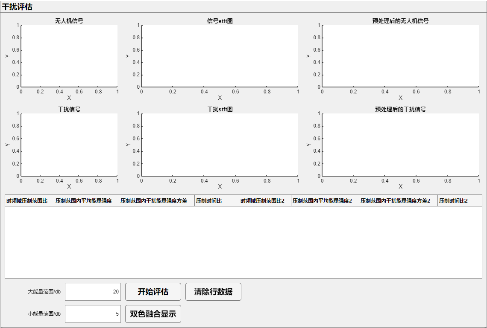

# UAVInt and UAVAnaly
本项目主要包含了信号参数分析、相似度分析、链路构建、干扰源参数优化、干扰效能评估等方面，app相关部分由于涉及版权，隐藏了部分代码，对本项目感兴趣的研究者可以联系22331171@zju.edu.cn，欢迎各位研究者与笔者进行交流。

## Link.mlapp

该app为主界面app，界面如下：



需要依次运行功率估计、干扰源选择、开始仿真部分，结果调试处用于显示链路的误码情况，如下为不施加干扰源时的误码情况：



干扰源处有两种干扰可供选择，一种是转发干扰，可设参数如下：



另一种是非转发干扰，可设参数如下：



可选择干扰源、扫频方式、多频选择进行组合，结果调试处可查看干扰源的生成情况。

### 干扰源快速仿真功能



可选序列如下：



当选定序列选项后，可输入待仿真序列值实现一次性自动仿真

### 参数分析部分

包含射频信号预处理和调制识别两部分。





其原理分别主要为组合时频分析和基于特征量的KNN识别。

### 干扰参数优化

优化部分采用了粒子群优化思想，可选择优化范围和优化条件等相关参数



### 干扰效能评估

该部分以时频矩阵为核心涉及参数指标进行评估，符合干扰效果的规律情况。



## 其他

本项目为相关代码的第1版本，还有一些最新成果尚未更新，如代码对您有帮助，请务必注明引用出处，如有引用不胜感激！

## 代码原理梳理

主程序位于APP/main_app文件夹下，主界面为Link.mlapp，此外还用到了其他app文件。依照运行逻辑依次介绍：

### 1、Link.mlapp：

这段代码是基于 **MATLAB App Designer** 开发的 **无人机纯导频链路仿真与分析工具**，核心功能是通过可视化 UI 配置链路参数、控制 Simulink 仿真、分析干扰效果与通信性能（如功率、误码率）。其设计围绕 “**UI 可视化配置 + Simulink 仿真驱动 + 结果实时分析**” 展开，实现了 “参数输入→仿真运行→数据处理→结果展示” 的完整闭环，适配无人机通信链路的干扰与抗干扰仿真场景。

#### 一、核心架构：UI 与仿真的协同逻辑

工具的本质是 “**MATLAB App 作为交互前端（参数配置、结果展示），Simulink 作为仿真后端（链路与干扰建模）** ”，通过 MATLAB 工作区实现数据交互，形成三层架构：

| 层级           | 技术依赖                                   | 核心作用                                                     |
| -------------- | ------------------------------------------ | ------------------------------------------------------------ |
| 交互层（前端） | MATLAB App Designer（UI 组件）             | 提供可视化参数输入（链路参数、干扰参数）、仿真控制按钮、结果图表显示，降低用户操作门槛 |
| 仿真层（后端） | Simulink（`Simple_Model_Packaging_7.slx`） | 实现无人机导频链路的完整建模（信号生成、M-PAM 调制、跳频、信道、干扰、接收解码），基于 UI 传递的参数运行仿真 |
| 数据交互层     | MATLAB 工作区（`assignin`/`evalin`）       | 作为 App 与 Simulink 的 “数据桥梁”：App 将 UI 参数写入工作区，Simulink 读取参数仿真；Simulink 将仿真结果写入工作区，App 读取结果分析 |

#### 二、关键模块原理解析

按 “**初始化→参数配置→仿真控制→结果分析**” 的流程，拆解核心逻辑：

##### 模块 1：App 初始化（属性定义与启动配置）

初始化阶段完成参数预设、UI 组件创建，为后续仿真铺路：

**1. 属性定义（存储核心参数）**

```matlab
properties (Access = private)
    BER_end; % 存储仿真结束时的最终误码率（私有，仅内部使用）
end

properties (Access = public)
    datalink_sampleRate; % 链路采样率（公有，可外部访问）
    datalink_selector_num; % 链路选择器数量（公有，可外部访问）
end
```

- 作用：通过属性持久化存储 App 运行中的关键参数（如采样率、误码率），避免数据丢失，支持模块间数据共享。

**2. 启动函数（`startupFcn`）**

```matlab
function startupFcn(app)
    app.datalink_sampleRate = 5e-8; % 预设链路采样率（50ns）
    app.datalink_selector_num = 3;  % 预设链路选择器数量（3个）
end
```

- 作用：App 启动时初始化默认参数，确保仿真有初始配置，无需用户手动输入所有参数。

**3. UI 组件创建（`createComponents`）**

这是 App 的 “视觉骨架”，通过 App Designer API 创建所有 UI 元素，按功能划分为 4 个核心面板，布局逻辑清晰：

| 面板名称           | 核心组件                                                     | 功能                                                         |
| ------------------ | ------------------------------------------------------------ | ------------------------------------------------------------ |
| 无人机链路参数输入 | 文本框（`output_vector`/`CodeTs`）、数值输入框（`M_Number`/`SkipF_Num`） | 配置导频链路关键参数：重复序列单元、码元周期、M-PAM 调制进制、跳频序列 / 点数 / 间隔 / 驻留时间等 |
| 干扰源设置         | 复选框（`CheckBox`）、标签页（`TabGroup`）、按钮（`Button`） | 切换干扰模式（非转发 / 转发）：非转发模式打开噪声产生器 GUI；转发模式配置间歇采样 / 转发参数（采样时间、转发次数等） |
| 仿真与结果调试     | 坐标轴（`Power_Estimate_axis`）、按钮（`Button_3`/`Button_2`）、时间示波器（`TimeScope`） | 控制仿真运行（开始仿真 / 功率估计），显示功率估计曲线、干扰功率曲线，打开结果显示窗口 |
| 其他功能           | 按钮（`Button_4`/`Button_5`/`Button_6`/`Button_7`）          | 扩展分析功能：参数分析、相似度分析、干扰源优化、干扰效能评估（打开对应子窗口） |

- 布局技巧：使用`uigridlayout`实现灵活的网格布局，确保组件对齐有序；通过`Panel`分组功能，用户可快速定位所需操作，降低认知成本。

##### 模块 2：参数配置与仿真控制（核心回调函数）

这是工具的 “大脑”，通过按钮回调将 UI 参数传递给 Simulink，触发仿真并处理结果，核心包括**功率估计仿真**和**完整链路仿真**两类场景：

###### 1. 功率估计仿真（`start_simButtonPushed`）

“开始功率估计” 按钮的回调，专注于链路发射端功率的计算与展示：

```matlab
function start_simButtonPushed(app, event)
    fbar = waitbar(0,'请等待..'); % 进度条（提升用户体验，显示仿真进度）
    
    % 1. UI参数→Simulink模型参数（关键：将用户输入传递给仿真模型）
    model.user_defined.Repeating_Sequence_Stair.output_vector = str2num(app.output_vector.Value); % 信号序列
    model.user_defined.Repeating_Sequence_Stair.CodeTs = app.CodeTs.Value; % 码元周期
    model.user_defined.CarrierSkipF.SkipF_vector = str2num(app.SkipF_vector.Value); % 跳频序列
    % ...（省略其他参数赋值：跳频点数、调制进制、采样率、信号功率等）
    
    % 2. 写入工作区，供Simulink读取
    assignin("base", 'model', model);

    waitbar(.25,fbar,'完成数据加载'); % 进度条更新
    
    % 3. 运行Simulink功率估计模型
    simOut = sim("Simple_Model_Packaging_7_1.slx",'stoptime',num2str(app.simulation_time.Value));

    waitbar(.75,fbar,'数据后处理'); % 进度条更新
    
    % 4. 结果处理：功率估计曲线绘制（确保结果数组与时间向量长度匹配）
    extend_multiple_2 = ceil(length(simOut.tout) / length(simOut.power_estimation_result.Data));
    Power_Estimate = reshape(repmat(reshape(simOut.power_estimation_result.Data,1,[]),extend_multiple_2,1),1,[]);
    plot(app.Power_Estimate_axis,simOut.power_estimation_result.Time, Power_Estimate,'Marker','none');
    xlabel(app.Power_Estimate_axis,"t/s"); ylabel(app.Power_Estimate_axis,"Amplitude");

    % 5. 计算并显示平均功率
    Power_Estimate_mean = mean(Power_Estimate(end-length(Power_Estimate)/2:end));
    app.Mean_Power_Display.Value = [ "平均功率：", num2str(round(Power_Estimate_mean,4)) ];

    waitbar(1,fbar,'处理结束'); close(fbar); % 进度条完成
end
```

- 核心逻辑：**参数传递→仿真运行→结果适配→可视化**。通过`model.user_defined`直接赋值 Simulink 模型的 “用户自定义参数”，避免手动修改模型；结果处理中用`extend_multiple_2`扩展数组，确保功率数据与时间向量长度一致（防止画图维度不匹配）。

###### 2. 完整链路仿真（`Button_3Pushed`）

“开始仿真” 按钮的回调，支持**非转发干扰**和**间歇转发干扰**两种模式，是工具的核心仿真功能：

```matlab
function Button_3Pushed(app, event)
    fbar = waitbar(0,'请等待..');
    try
        % 1. 加载基础模型参数（从工作区读取，避免重复配置）
        basemodel = evalin('base','model');
        if ~isfield(basemodel.Parameters,'NoiseGen')
            run("Scripts/defaultmodelstruct.m"); % 加载默认模型结构（容错）
        else
            model.Parameters = basemodel.Parameters;
        end
    catch ME
        disp(ME.message); uiconfirm(app.UIFigure,ME.message,'Process Prompt','Icon','warning');
    end

    % 2. 传递链路参数（与功率估计一致，省略重复代码）
    model.user_defined.Repeating_Sequence_Stair.output_vector = str2num(app.output_vector.Value);
    % ...（省略其他链路参数赋值）

    % 3. 根据干扰模式配置Simulink模块（关键：启用/禁用干扰模块）
    if app.CheckBox.Value == 0 % 非转发干扰模式
        Signal_delay_length = 0;
        assignin("base", 'Signal_delay_length', Signal_delay_length);
        load_system('Simple_Model_Packaging_7');
        % 禁用“间歇转发干扰”模块，启用“噪声源”模块
        set_param('Simple_Model_Packaging_7/信道模型封装/间歇转发干扰','commented','on');
        set_param('Simple_Model_Packaging_7/信道模型封装/NosieGen','commented','off');
    else % 间歇转发干扰模式
        % 传递转发干扰参数（采样时间、转发次数、功率系数等）
        Sample_time = app.ISDFJ_SampleTime.Value;
        Forwarding_times = app.ISDFJ_ForwardingTimes.Value;
        ISDFJ_parameter = struct('tau', Sample_time, 'n', Forwarding_times, ...);
        assignin("base", 'ISDFJ_parameter', ISDFJ_parameter);
        
        Signal_delay_length = 1; % 启用信号延迟（适配转发干扰）
        assignin("base", 'Signal_delay_length', Signal_delay_length);
        
        load_system('Simple_Model_Packaging_7');
        % 启用“间歇转发干扰”模块，禁用“噪声源”模块
        set_param('Simple_Model_Packaging_7/信道模型封装/间歇转发干扰','commented','off');
        set_param('Simple_Model_Packaging_7/信道模型封装/NosieGen','commented','on');
    end

    waitbar(.25,fbar,'完成数据加载');
    % 4. 运行完整链路仿真
    simOut = sim("Simple_Model_Packaging_7.slx",'stoptime',num2str(app.simulation_time.Value));
    assignin("base", 'simOut', simOut); % 仿真结果写入工作区

    % 5. 处理干扰功率结果（仅转发模式）
    if app.CheckBox.Value ~= 0
        extend_multiple_5 = ceil(length(simOut.tout) / length(reshape(simOut.NoisePowerISDFJ.Data,1,[])));
        NoisePower_ISDFJ = reshape(repmat(reshape(simOut.NoisePowerISDFJ.Data,1,[]),extend_multiple_5,1),1,[]);
        plot(app.ISDFJ_PowerEstimation,simOut.tout, NoisePower_ISDFJ,'Marker','none');
        xlabel(app.ISDFJ_PowerEstimation,"t/s"); ylabel(app.ISDFJ_PowerEstimation,"Amplitude");
    end

    waitbar(1,fbar,'处理结束'); close(fbar);
end
```

- 核心创新：**干扰模式动态切换**。通过`set_param`函数的`commented`属性（`on`= 禁用，`off`= 启用），动态控制 Simulink 模型中 “干扰模块” 和 “噪声模块” 的开关，无需手动修改模型连线；同时通过`ISDFJ_parameter`结构体传递转发干扰的复杂参数，适配不同干扰场景。

##### 模块 3：结果分析与扩展功能

仿真结束后，工具提供多维度结果分析，支持通信性能评估与干扰效果优化：

###### 1. 结果调试（`Button_2Pushed`）

“结果调试” 按钮的回调，打开结果显示窗口（`Result_Display`），展示链路关键环节的信号波形与误码率：

```matlab
function Button_2Pushed(app, event)
    try
        app_RD = Result_Display(app); % 打开结果显示子窗口
    catch ME
        disp(ME.message); uiconfirm(app.UIFigure,'无法打开','Process Prompt','Icon','warning');
    end
    
    simOut = evalin('base','simOut'); % 从工作区读取仿真结果
    
    % 1. 发送端信源波形
    extend_multiple_3 = ceil(length(simOut.tout) / length(simOut.sending_coding.Data));
    Signal_Source = reshape(repmat(reshape(simOut.sending_coding.Data,1,[]),extend_multiple_3,1),1,[]);
    plot(app_RD.Signal_Source_Generator_axis,simOut.tout,Signal_Source,'Marker','none');
    
    % 2. 接收端解码信号波形
    extend_multiple_4 = ceil(length(simOut.tout) / length(reshape(simOut.receiving_coding.Data,1,[])));
    Decoder_Signal = reshape(repmat(reshape(simOut.receiving_coding.Data,1,[]),extend_multiple_4,1),1,[]);
    plot(app_RD.Decoder_axis,simOut.tout,Decoder_Signal,'Marker','none');
    
    % 3. 发送端调制波形
    % ...（省略类似波形绘制代码）
    
    % 4. 误码率曲线（关键性能指标）
    error_bit_output = simOut.CodeBER.Data;
    extend_multiple = ceil(length(simOut.tout) / length(error_bit_output));
    error_rate = reshape(repmat(error_bit_output(:,1)',extend_multiple,1),1,[]);
    plot(app_RD.error_rate_axis, simOut.tout, error_rate*100,'Marker','none'); % 转换为百分比
    app.BER_end = error_rate(end); % 保存最终误码率
end
```

- 价值：**全链路信号可视化**。从 “发送信源→调制→接收解码” 展示完整信号流程，结合误码率曲线，用户可直观判断链路通信质量（如误码率是否达标），定位性能瓶颈（如调制或解码环节问题）。

###### 2. 扩展分析功能

通过 4 个按钮打开子窗口，实现深度分析：

- **参数分析（`Button_4Pushed`）**：打开`Parameter_Analysis`窗口，通过对真实信号分析得出输入的链路参数（如跳频间隔、码元周期）；
- **相似度分析（`Button_5Pushed`）**：打开`Similarity_Display`窗口，对比发送机信号与真实信号的相似度，评估信号失真程度；
- **干扰源优化（`Button_6ValueChanged`）**：打开`Interference_Optimization`窗口，优化干扰参数（如功率、采样时间）以提升干扰效果；
- **干扰效能评估（`Button_7ValueChanged`）**：打开`Interference_Assess`窗口，量化评估干扰对链路性能的影响（如干扰覆盖比）。

#### 三、核心设计思想

工具的设计围绕 “**用户友好、功能模块化、仿真自动化**” 三大原则，适配无人机通信链路仿真的专业需求：

##### 1. 可视化参数配置：降低仿真门槛

- 问题：无人机链路仿真涉及大量参数（跳频、调制、干扰等），手动修改 Simulink 模型易出错、效率低；
- 解决方案：通过 UI 输入框（文本 / 数值）将复杂参数可视化，用户无需了解 Simulink 模型细节，只需输入参数即可启动仿真；关键参数预设默认值（如采样率 5e-8），减少用户输入量。

##### 2. 模块化功能布局：提升操作效率

- 按 “**参数输入→干扰配置→仿真控制→结果分析**” 的逻辑划分面板，用户操作路径清晰（从左到右、从上到下）；
- 干扰模式通过 “复选框 + 标签页” 切换，非转发 / 转发模式的参数与模块配置隔离，避免功能混淆；
- 扩展功能（参数分析、干扰优化）以子窗口形式打开，既保留主界面简洁性，又支持深度分析。

##### 3. 自动化仿真与结果处理：减少人工干预

- 仿真流程自动化：参数传递、模型配置（模块启用 / 禁用）、进度条更新、结果画图全流程自动执行，无需用户手动介入；
- 结果适配智能化：通过`extend_multiple`扩展数组，解决 Simulink 仿真结果与时间向量长度不匹配的问题（常见于间歇干扰等非连续信号场景）；
- 错误处理容错化：用`try-catch`捕获子窗口打开失败、模型参数缺失等错误，通过`uiconfirm`显示警告，提升工具稳定性。

##### 4. 数据交互流畅：打通 UI 与仿真

- 基于 MATLAB 工作区的`assignin`（App→工作区）和`evalin`（工作区→App）实现数据传递，无需自定义复杂接口；
- Simulink 模型通过 “用户自定义参数（`model.user_defined`）” 读取 UI 配置，通过`simOut`结构体输出仿真结果，数据格式统一，便于 App 处理。

#### 四、总结

这款工具是**MATLAB App Designer 与 Simulink 结合的典型工程应用**，核心价值在于：

- **技术层面**：实现了 “UI 交互→Simulink 仿真→数据处理→结果展示” 的闭环，充分利用了 App Designer 的可视化优势和 Simulink 的仿真建模能力；
- **应用层面**：聚焦无人机纯导频链路的干扰与抗干扰仿真，支持功率估计、误码率分析、干扰优化等核心需求，可用于无人机通信系统的设计验证与性能评估；
- **设计层面**：以用户为中心，通过模块化布局、自动化流程、容错处理提升工具的易用性与稳定性，为复杂系统仿真提供了可复用的设计范式。

其设计思想可扩展到其他领域（如雷达信号处理、无线通信仿真），核心是 “**将复杂仿真流程封装为可视化工具，降低专业门槛，提升工程效率**”。

### 2、Noise_new.mlapp:

这段代码是基于 **MATLAB App Designer** 开发的 **干扰源配置与仿真工具**，核心功能是可视化配置多种类型的干扰信号（窄带噪声、单音、步进扫频、随机扫频、多频干扰）、设计专用带通滤波器、精准控制干扰功率，并通过 Simulink 仿真生成干扰信号，最终展示干扰的时域 / 频域特性与功率曲线。其设计围绕 “**工程化干扰需求 + 可视化操作 + 闭环仿真控制**” 展开，适配通信对抗、雷达干扰等场景中 “干扰信号定制化生成” 的核心需求。

#### 一、核心架构：干扰生成的全流程逻辑

工具的本质是 “**App 作为干扰参数配置与结果展示前端，Simulink（`Jammer_Generator.slx`）作为干扰信号生成后端**”，通过 MATLAB 工作区实现数据交互，形成 “参数配置→滤波器设计→功率控制→仿真生成→结果分析” 的完整闭环。核心架构分为 4 层：

| 层级       | 技术依赖                                       | 核心作用                                                     |
| ---------- | ---------------------------------------------- | ------------------------------------------------------------ |
| 参数配置层 | App Designer UI 组件（下拉框、输入框、标签页） | 按干扰类型（窄带 / 单音 / 扫频 / 多频）分类配置参数（频率、带宽、功率、扫频周期等），界面随干扰类型动态切换 |
| 信号处理层 | MATLAB 信号处理工具箱（FIR 滤波、FFT）         | 设计多带通滤波器（限制干扰带宽，避免杂散）、计算干扰信号的时域 / 频域特性，确保干扰信号符合工程要求 |
| 仿真控制层 | Simulink + 闭环功率调整逻辑                    | 读取 App 配置参数生成干扰信号，通过迭代仿真调整功率系数，使实际干扰功率逼近目标值（误差≤0.1~0.4） |
| 结果展示层 | App 子窗口 + 绘图 API                          | 显示干扰信号的时域波形、频域幅值 / 相位、功率估计曲线，计算并展示平均功率，直观验证干扰特性 |

#### 二、关键模块原理解析

按 “**初始化→参数配置→滤波器设计→干扰生成→结果分析**” 的流程，拆解核心逻辑：

###### 模块 1：初始化与属性定义（数据存储基础）

通过`properties`定义跨模块共享的核心参数，确保数据在 UI 交互、滤波设计、仿真控制中一致传递：

```matlab
properties (Access = public)
    datalink_selector_num; % 链路选择器数量（从父App继承）
    Mean_Power; % 干扰信号的平均功率（仿真后存储）
    quick_simulation_flag; % 快速仿真标志（0=正常，1=快速）
    Ts; % 干扰信号采样时间（核心时序参数）
    T_Noise; % 干扰信号显示/仿真时长
end
```

- 作用：`Ts`（采样时间）决定信号的频率分辨率，`Mean_Power`记录最终干扰功率，`datalink_selector_num`关联父 App 的链路配置，确保干扰与目标链路参数匹配。

###### 模块 2：多带通滤波器设计（`designMutiBandpassFilter`）

干扰信号需要特定带宽（避免影响非目标频段），该函数是 “干扰带宽控制” 的核心，基于**FIR 滤波器 + Kaiser 窗**设计多带通滤波器，适配多频干扰场景：

```matlab
function b = designMutiBandpassFilter(app, polit_filter_num, polit_centerFreq_arr, pass_bw, transitionWidth)
    fs = 1/app.Ts; % 采样频率 = 1/采样时间
    filter_freq = struct; % 存储各通带的频率边界
    
    % 1. 处理低频特殊情况（≤1.5e6 Hz）：避免DC附近频带重叠
    for freq_num = 1:polit_filter_num
        polit_centerFreq = polit_centerFreq_arr(freq_num);
        if polit_centerFreq <= 1.5e6
            % 低频仅保留上边界，简化滤波器设计
            filter_freq.(sprintf('f%d', 2*freq_num)) = polit_centerFreq;
            filter_freq = rmfield(filter_freq, 'f1');
            DC_0_flag = false;
        else
            % 常规频率：计算通带的上下边界（中心频率±带宽/2）
            filter_freq.(sprintf('f%d', 2*freq_num-1)) = polit_centerFreq - pass_bw/2;
            filter_freq.(sprintf('f%d', 2*freq_num)) = polit_centerFreq + pass_bw/2;
        end
    end

    % 2. 生成滤波器的通带/阻带边界（加入过渡带宽度，避免混叠）
    freq_group = [];
    filter_freq_name = fieldnames(filter_freq);
    for i = 1:round(length(filter_freq_name)/2)
        if isfield(filter_freq, 'f1')
            % 含DC的情况：通带-过渡带-阻带...
            freq_group = [freq_group filter_freq.(filter_freq_name{2*i-1})-transitionWidth ...
                filter_freq.(filter_freq_name{2*i-1}) filter_freq.(filter_freq_name{2*i}) ...
                filter_freq.(filter_freq_name{2*i})+transitionWidth];
        else
            % 不含DC的情况：简化边界计算
            freq_group = [freq_group filter_freq.(filter_freq_name{2*i-1}) ...
                filter_freq.(filter_freq_name{2*i-1})+transitionWidth];
        end
    end

    % 3. 配置滤波器的幅频特性（通带增益1，阻带衰减80dB）
    Band_amplitude = zeros(1, round((length(freq_group)+2)/2));
    deviation = ones(1, round((length(freq_group)+2)/2)) * 80; % 阻带衰减80dB
    if ~DC_0_flag
        Band_amplitude(1:2:length(Band_amplitude)) = 1; % 通带增益1
        deviation(1:2:length(Band_amplitude)) = 0.05; % 通带波动≤0.05
    else
        Band_amplitude(2:2:length(Band_amplitude)) = 1;
        deviation(2:2:length(Band_amplitude)) = 0.05;
    end

    % 4. 验证频带合理性（避免通带/阻带重叠）
    if ~all(diff(freq_group) > 0)
        error(sprintf('频带设计不合理，截止频率：%s',num2str(freq_group)));
    end

    % 5. 用Kaiser窗设计FIR滤波器（兼顾过渡带宽度与阻带衰减）
    [n,Wn,beta,ftype] = kaiserord(freq_group, Band_amplitude, deviation, fs); % 计算滤波器阶数与参数
    b = fir1(n, Wn, ftype, kaiser(n+1,beta), 'noscale'); % 生成FIR滤波器系数
end
```

- 核心创新：
  - **低频特殊处理**：针对≤1.5e6 Hz 的低频干扰，调整频带边界避免 DC（直流）附近的滤波失真；
  - **Kaiser 窗适配**：通过`kaiserord`自动计算滤波器阶数与 Kaiser 窗参数（`beta`），在 “过渡带宽度” 和 “阻带衰减” 间平衡（80dB 阻带衰减满足强抗干扰需求）；
  - **频带合理性校验**：通过`diff(freq_group) > 0`确保通带 / 阻带不重叠，避免滤波器设计失败。

###### 模块 3：干扰信号生成与功率闭环控制（`NoiseGenButtonPushed`）

这是工具的核心回调函数，实现 “按配置生成干扰→仿真→功率调整→再仿真” 的闭环，确保干扰功率精准匹配目标值：

```matlab
function NoiseGenButtonPushed(app, event)
    fbar = waitbar(0,'请等待..');
    % 1. 读取干扰类型配置（下拉框选择：窄带/单音/扫频/多频）
    dropValue1 = app.DropDown1.Value; % 干扰源类型
    dropValue2 = app.DropDown_2.Value; % 扫频方式
    dropValue3 = app.DropDown_3.Value; % 多频干扰

    % 2. 初始化Simulink模型参数（加载默认结构）
    run("Scripts/defaultmodelstruct.m")
    app.Ts = app.EditField_9.Value; % 读取采样时间
    model.Parameters.NoiseGen.NoiseTs = app.Ts; % 传递采样时间到Simulink
    model.Parameters.jammer_power_controller = sqrt(app.power_controller_coefficience.Value); % 功率控制系数（开方适配线性功率）

    % 3. 设计干扰信号的带通滤波器（限制带宽）
    polit_filter_num = app.passband_num.Value; % 通带个数
    polit_centerFreq = str2num(app.passband_centerFreq.Value); % 中心频率数组
    pass_bw = app.passband_bw.Value; % 通带带宽
    transitionWidth = app.transition_bw.Value; % 过渡带宽度
    model.Parameters.NoiseGen.noise_filter_b = designMutiBandpassFilter(app, polit_filter_num, polit_centerFreq, pass_bw, transitionWidth);

    % 4. 按干扰类型配置Simulink参数（以窄带/单音/步进扫频为例）
    switch dropValue1
        case "窄带噪声"
            model.Parameters.NoiseGen.Type = "高斯白噪声";
            model.Parameters.NoiseGen.GaussPower = 10; % 噪声功率密度
            model.Parameters.NoiseGen.pulse_noise_filter_b = designMutiBandpassFilter(app, 1, app.pulseNoise_centerFreq.Value, app.pulseNoise_pass_bw.Value, transitionWidth);
        case "单音噪声"
            model.Parameters.NoiseGen.Type = "单音正弦噪声";
            model.Parameters.NoiseGen.SineNoiseA = app.SinAM.Value; % 幅值
            model.Parameters.NoiseGen.SineNoiseF = app.SinF.Value; % 频率
        % ... 其他干扰类型配置（步进扫频、随机扫频、多频）
    end

    % 5. 第一次仿真：生成初始干扰信号
    assignin('base','model',model); % 参数写入工作区
    app.T_Noise = app.EditField_10.Value; % 仿真时长
    waitbar(.25,fbar,'开始运行Simulink模型');
    simOut = sim("Jammer_Generator.slx", 'stoptime', num2str(app.T_Noise));
    assignin("base", 'simOut', simOut);

    % 6. 功率闭环控制：迭代调整功率系数，使实际功率逼近目标值
    % 处理功率数据（确保与时间向量长度匹配）
    extend_multiple_2 = ceil(length(simOut.tout) / length(simOut.NoisePowerEstimation.Data));
    Power_Estimate = reshape(repmat(reshape(simOut.NoisePowerEstimation.Data,1,[]),extend_multiple_2,1),1,[]);
    Power_Estimate_mean = mean(Power_Estimate(end-length(Power_Estimate)/2:end)); % 计算后半段平均功率（避免启动瞬态）

    % 设定功率误差阈值（窄带/单音0.1，其他0.4，适配不同干扰的稳定性）
    Power_error = strcmp(dropValue1, "窄带噪声") || strcmp(dropValue1, "单音噪声") ? 0.1 : 0.4;

    % 迭代调整：直到功率误差≤阈值
    while (abs(Power_Estimate_mean - app.power_controller_W.Value) >= Power_error )
        if Power_Estimate_mean == 0
            app.power_controller_coefficience.Value = 0; % 避免除以0
        else
            % 比例调整：功率系数 = 当前系数 × 目标功率 / 实际功率
            app.power_controller_coefficience.Value = app.power_controller_coefficience.Value * app.power_controller_W.Value / Power_Estimate_mean;
        end
        % 更新功率系数并重新仿真
        model.Parameters.jammer_power_controller = sqrt(app.power_controller_coefficience.Value);
        assignin('base','model',model);
        simOut = sim("Jammer_Generator.slx", 'stoptime', num2str(app.T_Noise));
        assignin("base", 'simOut', simOut);
        % 重新计算实际功率
        Power_Estimate = reshape(repmat(reshape(simOut.NoisePowerEstimation.Data,1,[]),extend_multiple_2,1),1,[]);
        Power_Estimate_mean = mean(Power_Estimate(end-length(Power_Estimate)/2:end));
    end

    % 7. 保存结果（功率、噪声数据）
    app.Mean_Power = Power_Estimate_mean;
    model.Parameters.NoiseGen.NosiePowerEstimation = Power_Estimate_mean;
    assignin('base','model',model);
    waitbar(1,fbar,'处理结束');
    close(fbar);
end
```

- 核心逻辑：
  - **干扰类型适配**：通过`switch-case`针对不同干扰类型（窄带、单音、扫频）配置 Simulink 参数，如窄带噪声需额外设计脉冲滤波器，单音需配置幅值 / 频率；
  - **功率闭环**：通过 “仿真→计算功率→调整系数→再仿真” 的迭代，使干扰功率误差≤0.1~0.4（窄带 / 单音精度更高，因信号更稳定）；
  - **数据适配**：用`extend_multiple_2`扩展功率数据数组，确保与 Simulink 输出的时间向量长度一致（避免绘图维度不匹配）。

###### 模块 4：UI 交互与结果展示（动态适配 + 可视化验证）

UI 设计的核心是 “**按干扰类型动态切换参数界面**”，避免参数混乱；结果展示则通过子窗口直观呈现干扰特性：

**1. 动态 UI 切换（标签页联动下拉框）**

例如，选择 “窄带噪声” 时，UI 自动切换到`Tab`标签页，显示噪声功率、中心频率等参数；选择 “单音噪声” 则切换到`Tab_3`，显示幅值、载频参数：

```matlab
function DropDown1ValueChanged(app, event)
    value = app.DropDown1.Value;
    switch value
        case "None"
           app.TabGroup2.SelectedTab = app.NoneTab; % 无干扰：显示空界面
        case "窄带噪声"
           app.TabGroup2.SelectedTab = app.Tab; % 窄带：显示窄带参数
        case "单音噪声"
           app.TabGroup2.SelectedTab = app.Tab_3; % 单音：显示单音参数
    end
end
```

- 优势：用户无需面对所有参数，仅显示当前干扰类型所需配置，降低操作复杂度。

**2. 干扰特性展示（`NoiseDisp`+`NoiseGenButton_2Pushed`）**

点击 “结果调试” 按钮，打开`Jammer_Result_Display`子窗口，显示干扰的**时域波形、频域幅值 / 相位、功率曲线**：

```matlab
function NoiseDisp(app, app_NoiseRD,t, noise)
    % 1. 时域波形
    plot(app_NoiseRD.UIAxes,t,noise);
    % 2. 频域幅值（FFT+归一化）
    noise_freq = fft(noise);
    Fs = 1/app.Ts;
    freq = (-Fs/2) : Fs/length(noise_freq) : (Fs/2)-(Fs/length(noise_freq)); % 频率轴（双边谱）
    plot(app_NoiseRD.UIAxes2,freq,abs(fftshift(noise_freq))/ max(max(abs(fftshift(noise_freq))),1e-10));
    % 3. 频域相位（解卷绕，避免相位跳变）
    plot(app_NoiseRD.UIAxes3,freq,unwrap(angle(noise_freq)));
end

function NoiseGenButton_2Pushed(app, event)
    app_NoiseRD = Jammer_Result_Display(app); % 打开子窗口
    simOut = evalin('base','simOut'); 
    model = evalin('base','model'); 
    % 调用NoiseDisp显示时域/频域
    NoiseDisp(app, app_NoiseRD, simOut.Noise.Time, model.Parameters.NoiseGen.NoiseData);
    % 显示功率曲线与平均功率
    Power_Estimate = reshape(repmat(reshape(simOut.NoisePowerEstimation.Data,1,[]),extend_multiple_2,1),1,[]);
    plot(app_NoiseRD.UIAxes4,simOut.NoisePowerEstimation.Time, Power_Estimate);
    app_NoiseRD.Mean_Power_Display.Value = [ "平均功率估计为：", num2str(Power_Estimate_mean)];
end
```

- 价值：用户可直观验证干扰信号是否符合要求，如频域是否在目标频段内、功率是否达标、相位是否稳定。

###### 模块 5：辅助功能（提升工程实用性）

- **滤波器响应预览**：点击 “滤波响应” 按钮，绘制带通滤波器的幅频响应（20log10 (幅值)），验证滤波器是否正确限制干扰带宽；
- **清除缓存**：调用`Simulink.sdi.clear`清除仿真数据接口（SDI）缓存，避免旧数据干扰新仿真；
- **快速仿真**：打开`Quick_Simulation`子窗口，基于已配置的链路参数和输入干扰参数序列点快速生成干扰，减少重复操作（适合批量测试）。

#### 三、核心设计思想

工具的设计围绕 “**工程化需求、用户友好、精准控制**” 三大原则，适配干扰信号生成的专业场景：

##### 1. 模块化设计：适配多类型干扰需求

- 问题：不同场景需要不同类型的干扰（如窄带干扰针对特定通信频点，扫频干扰覆盖宽频段，多频干扰同时压制多个目标）；
- 解决方案：
  - 按 “干扰源类型→扫频方式→多频选择” 三层分类，每层用独立的下拉框 + 标签页控制，参数界面动态切换；
  - 滤波器设计、功率控制、结果展示等核心功能封装为独立函数，可单独调用（如滤波器函数可复用为其他干扰类型的带宽控制模块）。

##### 2. 可视化操作：降低专业门槛

- 问题：干扰生成涉及大量参数（频率、带宽、功率、扫频周期等），手动计算与配置易出错；
- 解决方案：
  - 用输入框、下拉框替代手动代码输入，关键参数预设默认值（如采样时间 1e-7、过渡带宽度 4e5 Hz）；
  - 结果以 “时域 + 频域 + 功率” 三图表展示，无需用户手动调用 FFT 或绘图函数；
  - 进度条显示仿真进度，避免用户等待时无反馈。

##### 3. 闭环控制：确保干扰精度

- 问题：干扰功率需精准匹配目标值（过强会浪费资源，过弱无法有效压制），且不同干扰类型的功率波动特性不同；
- 解决方案：
  - 采用 “迭代仿真 + 比例调整” 的闭环逻辑，针对窄带 / 单音（功率稳定）设置 0.1 的误差阈值，其他干扰（如扫频）设置 0.4，平衡精度与效率；
  - 功率计算取仿真后半段数据，避免启动瞬态（如滤波器暂态响应）导致的功率误差。

##### 4. 工程化细节：贴近实际应用

- **低频特殊处理**：针对≤1.5e6 Hz 的低频干扰调整滤波器参数，避免 DC 附近的滤波失真（实际硬件中 DC 干扰易受电源噪声影响）；
- **带宽控制**：所有干扰信号均通过带通滤波器限制带宽，避免杂散信号干扰非目标链路（符合电磁兼容（EMC）要求）；
- **数据适配**：用`extend_multiple`扩展数组长度，解决 Simulink 仿真结果与时间向量长度不匹配的常见问题（因干扰信号可能非连续采样）。

#### 四、总结

这款工具是**MATLAB App 与 Simulink 结合的工程化干扰生成解决方案**，核心价值在于：

- **技术层面**：整合信号处理（FIR 滤波、FFT）、仿真控制（Simulink 联动）、UI 设计（动态标签页），实现干扰生成的全流程自动化；
- **应用层面**：覆盖窄带、单音、扫频、多频等主流干扰类型，可直接用于通信对抗、雷达干扰等场景的前期仿真验证；
- **设计层面**：以用户为中心，通过模块化、可视化、闭环控制，平衡 “专业性” 与 “易用性”，既满足工程精度要求，又降低操作门槛。

其设计思想可扩展到其他信号生成场景（如雷达信号、通信信号），核心是 “**将复杂的工程流程封装为可视化工具，让专业功能可被非代码开发人员使用**”。

### 3、Quick_Simulation.mlapp

这段代码是基于 **MATLAB App Designer** 开发的 **干扰 - 链路联合快速仿真工具**（`Quick_Simulation`），核心功能是**批量自动化验证干扰参数对通信链路性能的影响**—— 通过输入参数序列（如功率、频率、跳频点数），自动遍历每个参数值、更新干扰配置、运行 Simulink 链路仿真，并最终输出误码率序列结果。其设计围绕 “**复用父 App 配置 + 批量自动化仿真 + 性能敏感分析**” 展开，解决了 “手动修改参数→重复启动仿真→人工记录结果” 的低效问题，适配通信对抗场景中 “干扰参数优化”“链路抗干扰性能评估” 的核心需求。

#### 一、核心架构：快速仿真的联动逻辑

该工具并非独立运行，而是**依赖父 App（前文的`Noise_new`干扰配置工具）的参数配置**，形成 “父 App 配置干扰→子 App 批量仿真→结果分析” 的联动流程。核心架构分为 3 层，关键是 “复用 + 自动化”：

| 层级         | 技术依赖                               | 核心作用                                                     |
| ------------ | -------------------------------------- | ------------------------------------------------------------ |
| 配置复用层   | 父 App 关联（`app.main = app_parent`） | 直接读取`Noise_new`中已配置的干扰参数（如干扰类型、带宽、采样时间），无需重复输入，确保干扰配置一致性 |
| 批量控制层   | 序列参数 + 循环遍历                    | 接收用户输入的参数序列（如功率`[5,10,20]`），自动遍历每个值，更新干扰模型参数，触发仿真 |
| 仿真与结果层 | Simulink 多链路适配 + 误码率收集       | 根据父 App 的`datalink_selector_num`（链路选择器数量），适配不同链路的 Simulink 模型，运行仿真并收集每个参数点的误码率 |

#### 二、关键模块原理解析

按 “**初始化→序列配置→批量仿真→结果输出**” 的流程，拆解核心逻辑：

##### 模块 1：初始化与父 App 关联（参数复用基础）

通过属性定义和启动函数，建立与父 App（`Noise_new`）的关联，实现干扰参数复用：

###### 1. 属性定义（跨 App 数据传递）

```matlab
properties (Access = public)
    main; % 存储父App（Noise_new）的引用，用于读取其配置的干扰参数
end

properties (Access = private)
    quick_simulation_flag; % 快速仿真状态标记（1=正在仿真，0=结束），避免多任务冲突
end
```

- 关键作用：`app.main`是 “桥梁”—— 通过它可直接访问`Noise_new`中的所有参数（如`app.main.DropDown1.Value`读取干扰类型、`app.main.power_controller_W.Value`读取目标功率），无需用户在快速仿真 App 中重复配置干扰。

###### 2. 启动函数（绑定父 App）

```matlab
function startupFcn(app, app_parent)
    app.main = app_parent; % 将传入的父App引用赋值给app.main，建立关联
end
```

- 调用时机：当从`Noise_new`中点击 “快速仿真” 按钮打开该 App 时，会自动将`Noise_new`的实例作为参数传入，完成绑定。
- 价值：确保快速仿真使用的干扰参数与父 App 完全一致，避免因参数不一致导致的仿真结果偏差。

##### 模块 2：核心回调 —— 批量快速仿真（`quick_simulationButtonPushed`）

这是工具的 “大脑”，实现 “序列遍历→参数更新→功率闭环→链路仿真→误码率收集” 的全自动化，是快速仿真的核心：

```matlab
function quick_simulationButtonPushed(app, event)
    try
        % 1. 读取关键配置：父App的干扰类型 + 当前选择的序列类型
        dropValue_sequence_type = app.DropDown_5.Value; % 序列类型（如"功率序列"）
        dropValue1 = app.main.DropDown1.Value; % 父App的干扰源类型（窄带/单音）
        dropValue2 = app.main.DropDown_2.Value; % 父App的扫频方式
        dropValue3 = app.main.DropDown_3.Value; % 父App的多频选择

        % 2. 合法性校验：确保干扰源和序列类型已选择
        if dropValue1 == "None" || dropValue_sequence_type == "None"
            uiconfirm(app.UIFigure,'未选择干扰源或序列类型','提示','Icon','warning');
            return ;
        end

        % 3. 解析用户输入的参数序列（如"5,10,20"→[5,10,20]）
        switch dropValue_sequence_type
            case "功率序列"
                param_sequence = str2num(['[' app.sequence_value1.Value ']']);
            case "单音干扰载频序列"
                param_sequence = str2num(['[' app.sequence_value1.Value ']']);
                dropValue1 = "单音噪声"; % 强制干扰类型为单音，避免配置冲突
            % ... 其他序列类型（步进扫频上下限、跳频点数）的解析
        end

        % 4. 初始化变量：误码率数组（存储每个序列点的结果）+ 进度条
        error_rate_array = zeros(1, length(param_sequence));
        fbar = waitbar(0,'请等待..');
        process_percent = 0.9 / length(param_sequence); % 每个序列点的进度占比

        % 5. 核心循环：遍历参数序列的每个值，批量仿真
        for i = 1:length(param_sequence)
            % 5.1 读取父App的干扰参数，更新Simulink模型
            model = evalin('base', 'model'); % 从工作区读取模型
            app.main.Ts = app.main.EditField_9.Value; % 复用父App的采样时间
            model.Parameters.NoiseGen.NoiseTs = app.main.Ts;

            % 5.2 根据序列类型，更新对应的干扰参数
            switch dropValue_sequence_type
                case "功率序列"
                    target_power = param_sequence(i); % 当前序列点的目标功率
                    app.main.power_controller_W.Value = target_power;
                    % 功率闭环控制（与Noise_new逻辑一致，确保实际功率逼近目标值）
                    if app.main.Mean_Power ~= 0
                        app.main.power_controller_coefficience.Value = ...
                            app.main.power_controller_coefficience.Value * target_power / app.main.Mean_Power;
                    end
                    model.Parameters.jammer_power_controller = sqrt(app.main.power_controller_coefficience.Value);

                case "单音干扰载频序列"
                    target_freq = param_sequence(i); % 当前序列点的目标频率
                    app.main.SinF.Value = target_freq;
                    model.Parameters.NoiseGen.SineNoiseF = target_freq;
            end

            % 5.3 复用父App的干扰配置（干扰类型、扫频、多频参数），更新模型
            % （与Noise_new中干扰参数配置逻辑完全一致，确保干扰类型正确）
            switch dropValue1
                case "窄带噪声"
                    model.Parameters.NoiseGen.Type = "高斯白噪声";
                    model.Parameters.NoiseGen.GaussPower = 10;
                    % ... 窄带噪声的其他参数
                case "单音噪声"
                    model.Parameters.NoiseGen.Type = "单音正弦噪声";
                    model.Parameters.NoiseGen.SineNoiseA = app.main.SinAM.Value;
            end
            % ... 扫频方式（dropValue2）、多频干扰（dropValue3）的参数更新

            % 5.4 功率闭环验证：确保干扰功率误差≤阈值（与Noise_new一致）
            simOut = sim("Jammer_Generator.slx", 'stoptime', num2str(app.main.T_Noise));
            Power_Estimate = reshape(repmat(reshape(simOut.NoisePowerEstimation.Data,1,[]),...
                ceil(length(simOut.tout)/length(simOut.NoisePowerEstimation.Data)),1),1,[]);
            Power_Estimate_mean = mean(Power_Estimate(end-length(Power_Estimate)/2:end));
            Power_error = strcmp(dropValue1, "窄带噪声") ? 0.1 : 0.4;

            while abs(Power_Estimate_mean - app.main.power_controller_W.Value) >= Power_error
                app.main.power_controller_coefficience.Value = ...
                    app.main.power_controller_coefficience.Value * app.main.power_controller_W.Value / max(Power_Estimate_mean, 1e-10);
                model.Parameters.jammer_power_controller = sqrt(app.main.power_controller_coefficience.Value);
                simOut = sim("Jammer_Generator.slx", 'stoptime', num2str(app.main.T_Noise));
                Power_Estimate_mean = mean(Power_Estimate(end-length(Power_Estimate)/2:end));
            end

            % 5.5 运行链路仿真：根据链路选择器数量，适配不同Simulink模型
            UAV_datalink_simulation_time = evalin('base','UAV_datalink_simulation_time');
            app.quick_simulation_flag = 1;
            assignin('base','quick_simulation_flag',app.quick_simulation_flag);

            % 适配不同链路（1-5条链路，对应不同的Simulink模型）
            switch app.main.datalink_selector_num
                case 1
                    simOut_link = sim("Simple_Model_Packaging.slx",'stoptime',num2str(UAV_datalink_simulation_time));
                case 2
                    simOut_link = sim("Simple_Model_Packaging_2.slx",'stoptime',num2str(UAV_datalink_simulation_time));
                case 3
                    simOut_link = sim("Simple_Model_Packaging_7.slx",'stoptime',num2str(UAV_datalink_simulation_time));
                % ... 其他链路的模型适配
            end

            % 5.6 收集误码率结果（取仿真结束时的稳定值）
            error_bit_output = simOut_link.CodeBER.Data;
            error_rate_array(i) = error_bit_output(end,1); % 存储当前序列点的误码率

            % 5.7 更新进度条
            waitbar(process_percent*i, fbar, '序列点仿真进行中');
        end

        % 6. 输出结果：显示误码率序列
        str_display = [ "快速仿真的误码率结果为：", num2str(round(error_rate_array, 4))];
        app.error_rate_result.Value = str_display;
        app.quick_simulation_flag = 0;
        assignin('base','quick_simulation_flag',app.quick_simulation_flag);

        waitbar(1,fbar,'完成一键快速仿真');
        close(fbar);
        uiconfirm(app.UIFigure,'快速仿真完成','提示','Icon','success');

    catch ME
        % 错误处理：捕获异常（如模型不存在、参数格式错误），提示用户
        disp(ME.message);
        uiconfirm(app.UIFigure,ME.message,'错误','Icon','warning');
        close(fbar);
        return ;
    end
end
```

- 核心逻辑拆解：
  1. **配置复用**：所有干扰基础参数（采样时间、带宽、干扰类型）均从父 App 读取，避免重复输入；
  2. **序列遍历**：针对用户输入的参数序列（如功率`[5,10,20]`），循环处理每个值，自动更新模型；
  3. **功率闭环**：复用`Noise_new`的功率控制逻辑，确保每个序列点的干扰功率精度（误差≤0.1~0.4）；
  4. **链路适配**：根据`datalink_selector_num`选择对应的链路模型，支持多链路场景；
  5. **结果收集**：记录每个序列点的误码率（取仿真结束时的稳定值），最终批量输出。

##### 模块 3：UI 设计与用户交互（简化操作）

UI 设计以 “**极简操作**” 为目标，仅保留 “序列类型选择→序列值输入→启动仿真→查看结果”4 个核心步骤，布局清晰：

| UI 组件                         | 功能                                   | 设计逻辑                                                     |
| ------------------------------- | -------------------------------------- | ------------------------------------------------------------ |
| 下拉框（`DropDown_5`）          | 选择序列类型（功率 / 频率 / 跳频点数） | 限定用户选择预设的序列类型，避免配置混乱，同时自动关联对应的参数更新逻辑 |
| 文本输入框（`sequence_value1`） | 输入参数序列（如 "5,10,20"）           | 支持逗号分隔的数值输入，通过`str2num`转换为数组，适配批量遍历需求 |
| 按钮（`quick_simulation`）      | 启动快速仿真                           | 一键触发整个批量仿真流程，无需用户干预； tooltip 提示使用前提（需先运行链路） |
| 文本区域（`error_rate_result`） | 显示误码率结果                         | 以字符串形式展示所有序列点的误码率，直观对比参数变化对性能的影响 |

- 设计细节：仅`sequence_value1`可编辑（核心输入），其他序列参数框（`sequence_value_2/3/4`）设为不可编辑，避免用户误操作；进度条实时显示仿真进度，提升用户体验。

#### 三、核心设计思想

该工具的设计围绕 “**效率提升、配置复用、鲁棒性保障**” 三大原则，解决通信对抗仿真中的实际痛点：

##### 1. 配置复用思想：减少重复操作，确保一致性

- **痛点**：手动仿真时，每次修改干扰参数（如功率）都需重新配置干扰类型、带宽、采样时间等基础参数，易出错且效率低；
- **解决方案**：通过`app.main`关联父 App，直接复用已验证的干扰配置，仅需输入待遍历的参数序列，大幅减少操作步骤；同时确保 “干扰参数→链路仿真” 的配置一致性，避免因参数 mismatch 导致的仿真结果无效。

##### 2. 批量自动化思想：适配参数敏感分析

- **痛点**：评估干扰参数对链路性能的影响（如 “功率从 5→20 变化时，误码率如何变化”），需手动修改参数→启动仿真→记录结果，重复多次；
- **解决方案**：通过 “序列输入 + 循环遍历” 实现全自动化 —— 用户输入参数序列后，工具自动遍历每个值、更新模型、运行仿真、收集误码率，最终输出批量结果，适合快速做 “参数 - 性能” 敏感分析（如找到使误码率超标的最小干扰功率）。

##### 3. 鲁棒性设计思想：降低使用门槛，避免异常

- **合法性校验**：仿真前检查 “干扰源是否选择”“序列类型是否选择”，避免空参数导致的仿真崩溃；
- **错误捕获**：用`try-catch`捕获模型不存在、参数格式错误（如输入非数值）等异常，通过弹窗提示具体错误信息，帮助用户定位问题；
- **状态标记**：`quick_simulation_flag`标记仿真状态，避免多线程同时仿真导致的资源冲突；
- **进度反馈**：进度条显示每个序列点的仿真进度，避免用户因 “无反馈” 误以为程序卡死。

##### 4. 多链路适配思想：提升工具通用性

- **痛点**：不同通信链路（如无人机不同频段的导频链路）需使用不同的 Simulink 模型，手动切换模型繁琐；
- **解决方案**：根据父 App 的`datalink_selector_num`（链路选择器数量），自动适配对应的 Simulink 模型（如链路 3 对应`Simple_Model_Packaging_7.slx`），无需用户手动选择模型，支持多链路场景的快速仿真。

#### 四、总结

这款`Quick_Simulation`工具是**通信对抗仿真的 “效率加速器”**，核心价值在于：

- **技术层面**：整合 “父 App 参数复用 + 批量循环 + 多链路适配”，实现干扰 - 链路联合仿真的全自动化，大幅提升仿真效率；
- **应用层面**：快速支持 “干扰参数优化”“链路抗干扰性能评估” 等核心场景，帮助用户快速定位关键干扰参数（如最小有效干扰功率）；
- **设计层面**：以 “减少用户操作、保障结果可靠” 为目标，通过复用、自动化、鲁棒性设计，降低专业仿真工具的使用门槛，让非代码开发人员也能高效完成参数敏感分析。

其设计思想可扩展到其他仿真场景（如雷达信号参数优化、无线信道参数评估），核心是 “**复用已有配置 + 批量自动化 + 结果可视化**”，适配工程中 “快速验证多参数组合对系统性能影响” 的需求。

### 4、Similarity_Diaplay.mlapp

这是一个基于 MATLAB App Designer 开发的**时间序列相似度计算工具**，核心功能是通过三种改进的动态时间规整（DTW）算法计算两个时间序列的相似度，并支持对结果进行加权处理。以下从原理和设计思想两方面进行解释：

#### 一、核心功能与原理

该工具的核心是通过三种改进的 DTW 算法（EWDTW、FLEDTW、SFDTW）计算时间序列的相似度，本质是解决 “长度不同的时间序列如何衡量相似性” 的问题（传统方法如欧氏距离无法处理长度不匹配的序列）。

##### 1. 时间序列与相似度计算的基本问题

时间序列是按时间顺序排列的数据（如传感器数据、股票价格等），其相似度计算的核心挑战是：

- 序列长度可能不同（如一个序列有 7 个点，另一个有 12 个点）；
- 序列可能存在 “时间偏移”（如两个相似的波动模式，但出现时间不同步）。

动态时间规整（DTW）通过寻找两个序列的 “最优对齐路径” 解决上述问题，其核心是构建距离矩阵并累积最小距离，最终以累积距离衡量相似度（距离越小，相似度越高）。

##### 2. 三种改进算法的原理

代码实现了三种基于 DTW 的改进算法，针对不同特征进行优化：

###### （1）EWDTW（带权重的极值点 DTW）

- **核心思想**：聚焦序列的极值点（极大值、极小值），忽略噪声，通过权重调整不同位置的重要性。
- 步骤：
  1. 提取极值点：通过`EWDTW_1`函数提取序列的起点、终点、极大值（标记 1）、极小值（标记 - 1），形成极值序列；
  2. 计算加权距离：EWDTW_2 函数计算两个极值序列的距离，考虑三方面：
     - 位置距离（极值点在原序列中的位置差）；
     - 值距离（极值点的数值差）；
     - 类型距离（极值类型是否匹配，如极大值对极大值权重更高）；
  3. 动态规划累积距离：通过指数函数动态调整权重（中间位置的匹配权重更高），最终累积距离为相似度结果。

###### （2）FLEDTW（极值特征分解 DTW）

- **核心思想**：将序列的极大值和极小值分离为两个特征矩阵，分别计算相似度后求和，更精细地捕捉波动特征。
- 步骤：
  1. 提取极值点：通过`local_extreme`函数（与`EWDTW_1`功能相同）提取极值；
  2. 构建特征矩阵：max_min_matrix 函数为极大值和极小值分别构建特征矩阵，包含 4 个特征：
     - 极值点数值、左邻域斜率、右邻域斜率、归一化位置；
  3. 分别计算相似度：对极大值特征矩阵和极小值特征矩阵分别用 DTW 计算距离，两者之和为最终结果。

###### （3）SFDTW（信号分解 DTW）

- **核心思想**：将原始序列分解为三种信号（滤波信号、斜率信号、波动信号），综合多维度特征衡量相似度。
- 步骤：
  1. 信号分解：separate 函数将序列分解为：
     - 滤波信号（移动平均平滑，去除噪声）；
     - 波动信号（原始信号与滤波信号的差，反映局部波动）；
     - 斜率信号（基于滤波信号的极值点计算，反映整体趋势）；
  2. 综合距离计算：分别计算三种信号的距离，通过权重参数（η、μ）调整重要性，累积后得到最终距离。

##### 3. 加权处理功能

工具的第二个标签页支持对三种算法的结果进行加权求和，公式为：
`加权结果 = 权重1×EWDTW结果 + 权重2×FLEDTW结果 + 权重3×SFDTW结果`
用户可通过输入框自定义权重，灵活调整不同算法的影响程度。

#### 二、代码设计思想

##### 1. 模块化与封装

- 算法封装：三种核心算法均通过独立子函数实现（如`EWDTW_1`、`FLEDTW_1`等），便于单独调试和复用；
- 功能分离：通过标签页（Tab）分离 “直接计算” 和 “加权处理” 功能，逻辑清晰。

##### 2. 用户友好的交互设计

- 多方式输入：支持手动输入时间序列（编辑框）或从`.mat`文件导入（路径导入按钮），满足不同场景；
- 错误处理：通过`errordlg`提示异常（如文件无变量、数据非矩阵等），提升鲁棒性；
- 可视化反馈：计算结果通过文本区域实时显示，导入成功 / 失败通过弹窗提示。

##### 3. 复用与扩展性

- 数据导入逻辑复用：四个路径导入按钮（`Path_import1`等）共享相似的文件加载逻辑，仅目标编辑框不同；
- 算法可扩展：标签页和按钮的回调函数结构统一，便于添加新的相似度算法（如增加第四个算法只需新增计算逻辑和显示区域）。

#### 三、总结

该工具的核心思想是：**基于改进的 DTW 算法，从极值点、特征分解、信号分解等多维度捕捉时间序列的相似性，并通过可视化界面降低使用门槛，支持灵活的加权综合评估**。适用于时间序列分析（如传感器数据匹配、模式识别等场景）。

### 5、Interference_Optimization.mlapp

这段代码是基于 **MATLAB App Designer + 粒子群优化（PSO）+ Simulink 仿真** 开发的 **干扰源参数优化工具**（`Interference_Optimization`），核心目标是**自动寻找最优的干扰参数组合**，以最大化对通信链路的干扰效果（通过提升链路误码率 BER 衡量）。其设计围绕 “**仿真驱动优化、策略全覆盖、工程约束保障**” 展开，解决了 “手动调试干扰参数效率低、策略组合多难以遍历、参数有效性无法验证” 的痛点，适配通信对抗场景中 “干扰策略优化” 的核心需求。

#### 一、核心架构与工作流程

该工具的本质是 “**优化算法（PSO）+ 适应度函数（Simulink 干扰 - 链路联合仿真）+ UI 交互**” 的三层闭环架构，流程如下：

1. **参数配置层**：用户通过 UI 设置优化算法参数（PSO 的迭代次数、种群大小等）、干扰参数范围（功率、频率、带宽等）、工程约束（滤波器阻带、扫频速率等）；
2. **策略生成层**：自动生成所有可能的 “干扰源类型 + 干扰方式 + 分段数” 组合（称为`scenarios`），覆盖多维度干扰策略；
3. **优化执行层**：PSO 算法遍历参数空间，每次迭代调用`getBER`函数（适应度函数），通过 Simulink 仿真计算当前参数组合的干扰效果（误码率）；
4. **结果反馈层**：记录优化过程中的最优参数，实时显示误码率结果，并支持策略可视化、优化暂停 / 继续等交互。

#### 二、关键模块原理解析

按 “**核心功能函数→优化逻辑→UI 交互**” 拆解，重点解释 “如何通过 PSO 找到最优干扰参数” 和 “如何保障仿真与优化的有效性”。

##### 模块 1：核心适应度函数 ——`getBER`（干扰效果评估）

`getBER`是优化的 “标尺”，其作用是**根据输入的干扰参数，通过 Simulink 仿真计算通信链路的误码率（BER）**，BER 越高表示干扰效果越好。核心逻辑分 5 步：

###### 1. 干扰参数配置（按策略分类）

首先根据 “干扰源类型”（如单音正弦噪声、脉冲噪声）和 “干扰方式”（如步进调频、跳频干扰）的组合，配置对应的参数：

- **单音正弦噪声 + 步进调频**：配置载频（`SinF`）、步进扫频上下限（`StepSweepFmax/min`）、扫频周期（`StepSweepT`）、跳频点数（`StepSweepN`）；
- **脉冲噪声 + 跳频干扰**：配置脉冲中心频率（`pulseNoise_centerFreq`）、带宽（`pulseNoise_pass_bw`）、跳频序列（`MultiFreqSkipSequence`）、驻留时间（`MultiFreqSkipTime`）；
- 其他组合（如 PN 码 MSK 噪声 + 步进调频）同理，覆盖代码中 8 种干扰策略。

###### 2. 工程约束检查（过滤无效参数）

优化前先验证参数是否满足工程可行性，避免无效仿真：

- `checkConstraints_filter`：确保多通带滤波器的通带间阻带≥150kHz（避免频带重叠，滤波器无法实现）；
- `checkConstraints_stepSweep`/`checkConstraints_hopping`：限制扫频速率上限（避免驻留时间过短导致干扰能量分散）、跳频间隔（避免频率冲突）；
- 若不满足约束，直接返回`BER=0`（标记为无效参数组合，PSO 会自动跳过）。

###### 3. Simulink 干扰信号生成（`Jammer_Generator.slx`）

配置干扰源模型参数，生成符合要求的干扰信号：

- **功率闭环控制**：初始功率系数为 1，通过多次仿真调整`jammer_power_controller`，使实际干扰功率与目标功率（`power_controller_W`）的误差≤0.1（单音 / 脉冲噪声）或 0.4（调制噪声），确保仿真准确性；
- **滤波器设计**：调用`designMutiBandpassFilter`生成多通带滤波器，滤除干扰信号的杂波，保证干扰频段精准。

###### 4. 通信链路仿真（`Simple_Model_Packaging_7.slx`）

将生成的干扰信号注入通信链路，仿真干扰对链路的影响：

- 数据链参数从全局变量`DataLink_config`读取，包括码元速率（`CodeTs`）、跳频参数（`SkipF_vector`）、调制方式（`M_ary_number`）、信噪比（`Awgn_SNR`）等，确保链路配置与实际场景一致；
- 运行链路仿真，获取误码率序列（`CodeBER.Data`），取最后时刻的稳定值作为当前干扰参数的`BER`结果。

###### 5. 返回 BER 值（作为 PSO 的适应度）

PSO 默认最小化目标函数，因此实际优化时会将`-BER`作为目标（即 PSO 找到的最小值对应`BER`的最大值，干扰效果最优）。

##### 模块 2：PSO 优化逻辑（参数寻优核心）

采用**粒子群优化（PSO）** 算法遍历干扰参数空间，找到最优组合。PSO 的核心是 “粒子通过个体经验和群体经验调整位置，逐步逼近最优解”，代码中通过`particleswarm`函数实现，关键配置如下：

###### 1. PSO 参数配置（`global_config`）

用户通过 UI 设置 PSO 的核心参数，平衡优化效率与精度：

| 参数                          | 作用                                                         |
| ----------------------------- | ------------------------------------------------------------ |
| `MaxTime`/`MaxIterations`     | 优化时间上限（小时）/ 迭代次数上限（默认 500），防止优化耗时过长； |
| `SwarmSize`                   | 种群大小（默认 50），种群越大越易找到全局最优，但仿真次数越多； |
| `Self/SocialAdjustmentWeight` | 个体学习因子（默认 2）/ 社会学习因子（默认 2.2），控制粒子向自身 / 群体最优解靠近的速度； |
| `InertiaRange`                | 惯性权重范围（默认 [0.4,0.9]），前期大权重探索全局，后期小权重精细收敛； |
| `HybridFcn`                   | 二次优化器（如`fmincon`），在 PSO 基础上进一步精细调参，提升精度； |
| `UseParallel`                 | 是否启用并行计算（默认 false），多核心同时仿真，加速多策略遍历。 |

###### 2. 策略遍历（`scenarios`生成）

自动生成所有可能的干扰策略组合（`scenarios`），覆盖多维度变量：

- **干扰源类型**：单音正弦噪声、脉冲噪声（可扩展至 PN 码 MSK 噪声、随机二元码调制噪声）；
- **干扰方式**：步进调频、跳频干扰；
- **分段数**：干扰频段的划分数量（如 22 段，`Interference_number`）；
- **带宽是否可变**：是否优化滤波器带宽（`Bw_is_variable`）。

每个`scenario`包含参数的上下限（`lb/ub`）、初始值（`x0`），例如 “单音 + 步进调频 + 22 段” 对应的参数维度包括：载频、扫频上下限、扫频周期、跳频点数、多频频率等。

###### 3. 优化执行与记录（`save_results`）

`save_results`作为 PSO 的`OutputFcn`，实时记录优化过程并清理缓存：

- **迭代记录**：用`history`结构体保存每次迭代的最优参数（`X`）、目标值（`Fval`）、迭代次数（`Iter`），优化结束后追加到`pso_history7.mat`；
- **缓存清理**：定期删除 Simulink 的`slcache`和`slprj`目录，避免缓存文件占用过多空间（默认当缓存 > 40GB 时清理）；
- **状态反馈**：在 UI 的`TextArea`显示当前迭代次数、最优 BER、参数组合，方便用户实时监控。

##### 模块 3：交互功能设计（提升用户体验与可控性）

###### 1. 两种优化模式（全局 / 单一策略）

- **全局优化（ButtonPushed）**：遍历用户指定的策略索引（`track_sequence`），批量优化多个`scenarios`，适合快速筛选最优策略；
- **单一策略优化（Button_2Pushed）**：针对用户指定的具体策略（如 “单音 + 步进调频 + 22 段”），聚焦该策略的参数精细调优，适合深入验证。

###### 2. 优化暂停 / 继续（`go_stop`/`go_on`）

通过 “标记文件” 机制实现灵活控制：

- 点击 “优化暂停”：创建`INTERRUPT_PAUSE.flag`文件，优化循环检测到该文件后，在当前策略仿真结束后暂停；
- 点击 “优化继续”：删除标记文件，更新`isPaused=false`，优化继续执行；
- 优势：避免优化过程中强制终止导致的进度丢失，且暂停时降低 CPU 占用。

###### 3. 策略可视化（`Button_3Pushed`）

创建`Track_Visiable`子 App，将所有`scenarios`以表格形式展示，包含：

- 策略的核心信息（干扰源类型、干扰方式、分段数）；
- 参数范围（`lb/ub`）、初始值（`x0`）；
- 作用：帮助用户直观了解所有可用策略，避免盲目优化。

##### 模块 4：全局变量与参数传递（解耦与复用）

通过全局变量（如`DataLink_config`、`Interference_other_config`）实现跨函数参数传递，避免多层嵌套传参的冗余：

| 全局变量                      | 存储内容                                                     |
| ----------------------------- | ------------------------------------------------------------ |
| `DataLink_config`             | 通信链路参数（码元速率、跳频参数、调制方式、信噪比等），从父 App（`main`）读取； |
| `Interference_other_config`   | 干扰辅助参数（目标功率、功率误差范围、误码率延时等）；       |
| `Constraint_condition_config` | 工程约束（滤波器阻带宽度、扫频速率上限等）；                 |
| `MM_config`                   | 文件路径（缓存目录、历史记录 / 结果保存路径）、缓存大小阈值； |

#### 三、核心设计思想

该工具的设计围绕 “**工程实用性、优化有效性、用户友好性**” 三大原则，解决通信对抗优化中的实际问题：

##### 1. 仿真驱动优化：贴近工程实际

- **痛点**：传统优化仅基于数学模型，忽略 Simulink 仿真中的非线性因素（如滤波器纹波、链路噪声），导致优化结果与实际系统偏差大；
- **解决方案**：将`getBER`的核心定为 “Simulink 干扰 - 链路联合仿真”，每一次参数评估都基于真实的链路响应，确保优化结果可直接落地；
- **关键细节**：功率闭环控制（多次仿真调整功率系数）、约束检查（过滤工程不可行参数），进一步提升仿真与实际的一致性。

##### 2. 策略全覆盖：避免局部最优

- **痛点**：干扰策略组合多（2 种干扰源 ×2 种干扰方式 ×N 种分段数），手动遍历效率低，易遗漏最优策略；
- **解决方案**：自动生成`scenarios`，覆盖所有可能的策略组合，支持 “全局批量优化 + 单一精细调优”，既保证覆盖广度，又兼顾优化深度；
- **关键细节**：`scenarios`的参数范围（`lb/ub`）基于工程经验设置（如单音载频范围、脉冲带宽范围），避免参数空间过大导致优化发散。

##### 3. 鲁棒性设计：保障优化稳定运行

- **约束过滤**：提前剔除无效参数（如滤波器通带重叠、扫频速率超标），减少无用仿真，提升优化效率；
- **缓存清理**：定期删除 Simulink 缓存，避免因缓存文件冲突导致仿真崩溃，或占用过多磁盘空间；
- **接续训练**：支持从历史最优参数（`history`）开始优化，避免因断电、暂停导致的进度丢失，节省重复仿真时间；
- **错误捕获**：`getBER`中通过`try-catch`捕获仿真异常（如模型不存在、参数格式错误），返回`BER=0`并提示错误，避免优化中断。

##### 4. 用户友好：降低使用门槛

- **UI 分层设计**：将参数按 “优化算法→干扰范围→工程约束→优化模式” 分类，布局清晰，用户无需理解底层代码即可配置；
- **实时反馈**：`TextArea`实时显示迭代进度、最优 BER、参数组合，优化结束后自动保存结果文件，方便后续分析；
- **灵活交互**：支持暂停 / 继续、策略可视化，用户可根据需求调整优化节奏，或直观筛选策略，无需手动整理`scenarios`。

#### 四、总结

这款`Interference_Optimization`工具是**通信对抗场景的 “智能调参助手”**，核心价值在于：

- **技术层面**：整合 “PSO 优化算法 + Simulink 仿真 + 工程约束检查”，实现干扰参数的自动化、高精度寻优，大幅降低手动调试成本；
- **应用层面**：快速支持 “干扰策略筛选”“最优参数验证”“抗干扰性能评估” 等场景，帮助用户找到 “以最小干扰功率实现最大链路误码率” 的参数组合；
- **设计层面**：以 “工程实用性” 为核心，通过仿真驱动、策略全覆盖、鲁棒性保障，平衡优化效率与结果可靠性，同时通过 UI 交互降低使用门槛，适配非算法专业的工程人员。

其设计思想可扩展到其他优化场景（如雷达信号参数优化、无线信道抗干扰优化），核心是 “**以仿真验证代替纯数学建模，以自动化遍历代替手动调试，以工程约束保障结果有效性**”。

### 6、Interference_Assess.mlapp

这段代码是基于 **MATLAB App Designer + 短时傅里叶变换（STFT）+ 量化指标计算** 开发的 **干扰效果评估工具**（`Interference_Assess`），核心目标是**从 “时域 + 时频域” 双维度量化干扰对通信信号（如无人机信号）的压制效果**，解决 “干扰效果主观判断模糊、缺乏客观指标支撑” 的痛点，是前序 “干扰参数优化工具” 的关键后续环节（形成 “优化→仿真→评估” 闭环）。

#### 一、核心定位与工作流程

该工具的本质是 “**信号分析（STFT）+ 量化指标（压制效果）+ 可视化验证**” 的三位一体评估系统，核心流程如下：

1. **数据获取**：从 MATLAB 基础工作区（`base workspace`）读取前序 Simulink 仿真生成的 “信号 + 干扰” 数据（`simOut`）；
2. **信号可视化**：分别展示信号 / 干扰的**时域波形**和**时频域热力图（STFT）**，直观观察两者的时间 - 频率分布；
3. **数据预处理**：通过用户设定的能量阈值，过滤低能量噪声，保留有效信号 / 干扰成分，确保指标计算准确性；
4. **量化指标计算**：从 “时频覆盖、能量强度、稳定性、时间持续性”4 个维度计算 8 个评估指标（分 “大能量 / 小能量” 两组场景）；
5. **结果交互**：表格展示指标、支持数据清理、双色融合显示时频域叠加效果，辅助用户客观判断干扰有效性。

#### 二、关键模块原理解析

按 “**数据来源→信号分析→指标计算→可视化交互**” 拆解，重点解释 “如何通过 STFT 实现时频域分析” 和 “如何量化干扰压制效果”。

##### 模块 1：数据来源与预处理（确保分析有效性）

###### 1. 数据获取：衔接前序仿真

代码通过 `evalin('base', 'simOut')` 从基础工作区读取数据，核心数据包括：

- **无人机信号**：`simOut.sending_modulation_wave.Data`（待保护的通信信号）；
- **干扰信号**：`simOut.jamming_wave1.Data`（待评估的干扰信号）；
- **采样参数**：`simOut.Parameters.NoiseGen.NoiseTs`（采样时间）→ 推导采样频率 `fs=1/Ts`。

**设计逻辑**：与前序 “干扰参数优化工具”（`Interference_Optimization`）共用仿真数据，避免数据割裂，确保评估结果与优化参数直接关联。

###### 2. 数据预处理：过滤噪声，聚焦有效成分

通过 “能量阈值过滤” 排除低能量噪声，只保留对通信有意义的信号 / 干扰成分，核心逻辑：

- **阈值设定**：用户通过 UI 输入两个能量阈值（`th1_max` 对应 “大能量范围”，`th2_min` 对应 “小能量范围”）；
- 过滤规则：
  1. 计算信号时频域（STFT）的最大能量 `max(B)`（`B` 为信号 STFT 结果）；
  2. 大能量阈值：`stft_threshold = max(B) - th1_max`，低于该值的信号 / 干扰置 0（保留强能量成分）；
  3. 小能量阈值：`stft_threshold = max(B) - th2_min`，同理保留中弱能量成分。

**核心目的**：避免噪声对指标的干扰（如微弱噪声被误算为 “有效干扰”），同时覆盖 “强能量主信号” 和 “弱能量副信号” 两种场景，评估更全面。

##### 模块 2：信号分析核心 ——STFT 时频域变换

传统时域分析（如波形图）无法同时观察 “时间 - 频率” 分布（例如跳频信号的频率随时间变化），而 **STFT** 是解决该问题的核心工具，代码中通过 `stft` 函数实现：

###### 1. STFT 关键参数

```matlab
win_len = 850;  % 窗长：平衡时间分辨率与频率分辨率
[data_stft, stft_f, stft_t] = stft(data_1_effective, fs, 'Window', hann(win_len,"periodic"));
```

- **窗函数**：选用汉宁窗（`hann`），减少频谱泄漏（避免信号突变导致的频率扩散）；
- 输出结果：
  - `data_stft`：STFT 复数结果（幅度反映能量，相位反映相位信息）；
  - `stft_t`：时间轴（对应信号的时间点）；
  - `stft_f`：频率轴（对应信号的频率成分）。

###### 2. 时频域可视化

通过 `imagesc` 函数将 STFT 幅度转换为热力图，直观展示能量分布：

```matlab
imagesc(app.UIAxes2, stft_t, stft_f, 10.*log10(abs(data_stft)));
axis(app.UIAxes2, "xy");  % 翻转y轴（让低频在下、高频在上，符合直觉）
colorbar(app.UIAxes2,"eastoutside");  % 颜色条：映射能量强度（dB）
```

- **能量单位**：`10.*log10(abs(data_stft))` 将幅度转换为分贝（dB），符合工程中能量强度的常用表示方式；
- **核心价值**：可直接观察 “干扰是否覆盖信号的时频区域”（如干扰的频率范围是否与信号重叠、在哪些时间段有压制）。

##### 模块 3：核心评估指标（量化干扰压制效果）

代码从 “**时频覆盖广度、能量压制强度、能量稳定性、时间持续度**”4 个维度设计 8 个指标（分 “大能量 / 小能量” 两组），每个指标都对应明确的物理意义，是评估的 “客观标尺”。

###### 指标 1：时频域压制范围比（核心覆盖指标）

- **物理意义**：干扰能 “有效压制”（干扰能量比信号高 3dB 以上）的时频点占信号总时频点的比例（百分比），反映干扰的时频覆盖有效性。
- **计算逻辑**：

```matlab
mask_2 = (B ~= 0);  % 信号非零的时频点（有效信号区域）
mask_1 = (A - B >= 3) & mask_2;  % 干扰比信号高3dB且在信号区域内的时频点
Time_frequency_domain_suppression_range_ratio = length(linear_idx)/length(linear_idx_2)*100;
```

- **关键阈值**：3dB 对应功率翻倍（工程中认为 “功率翻倍” 是有效压制的最小标准）。

###### 指标 2：压制范围内平均能量强度（能量强度指标）

- **物理意义**：干扰在 “有效压制区域” 内的平均能量水平，反映干扰的压制力度（值越大，压制越强）。
- **计算逻辑**：

```matlab
average_energy_intensity = mean(A(mask_1));  % A为干扰STFT结果，取压制区域均值
```

- **设计细节**：不做归一化（注释明确说明 “归一化标准不同会导致失真”），保留原始能量尺度，便于不同干扰策略的横向对比。

###### 指标 3：压制范围内能量强度方差（稳定性指标）

- **物理意义**：干扰在压制区域内的能量波动程度（方差越小，干扰能量越稳定，压制效果越均匀）。
- **计算逻辑**：

```matlab
average_energy_variance = std(A(mask_1));  % 用标准差衡量波动（方差的平方根，单位与能量一致）
```

- **工程价值**：避免 “局部能量极高但整体波动大” 的干扰（如脉冲干扰）被误判为有效 —— 这类干扰可能仅在瞬间压制，稳定性差。

###### 指标 4：压制时间比（时间持续性指标）

- **物理意义**：干扰在 “时间维度” 上有效压制的比例（即 “有多少时刻，干扰能覆盖信号 50% 以上的频率点”），反映干扰的时间持续性。
- **计算逻辑**：

```matlab
column_sums_1 = sum(mask_1, 1);  % 按时间（列）求和：每个时刻的压制频率点数
column_sums_2 = sum(mask_2, 1);  % 每个时刻的信号频率点数
Spectrum_suppression_probability = column_sums_1 ./ column_sums_2 * 100;  % 每个时刻的压制频率占比
Suppression_time_ratio = length(find(Spectrum_suppression_probability > 10)) ./ length(column_sums_1) * 100;
```

- **关键阈值**：10%（经验值）—— 确保 “有效压制时刻” 不是 “个别频率点的偶然压制”，而是有一定频率范围的持续压制。

###### 两组指标设计：覆盖全能量场景

代码计算 “大能量范围”（`th1_max`）和 “小能量范围”（`th2_min`）两组指标，原因是：

- 大能量成分：信号的 “核心通信频段”，干扰需优先压制；
- 小能量成分：信号的 “边缘 / 副频段”，干扰对这类成分的压制能力反映干扰的 “全面性”；
  两组指标结合，避免 “只压制核心频段、忽略边缘频段” 的干扰被误判为 “有效”。

##### 模块 4：可视化与交互功能（提升评估直观性）

###### 1. 多维度可视化

| 可视化内容               | 展示位置            | 核心作用                                                     |
| ------------------------ | ------------------- | ------------------------------------------------------------ |
| 信号 / 干扰时域波形      | `UIAxes`/`UIAxes3`  | 直观观察信号 / 干扰的时间 - domain 幅度变化（如是否有脉冲、持续干扰）； |
| 信号 / 干扰时频域热力图  | `UIAxes2`/`UIAxes4` | 观察两者的时间 - 频率重叠区域（如干扰是否覆盖信号的跳频频段）； |
| 预处理后时频图           | `UIAxes5`/`UIAxes6` | 验证阈值过滤效果（是否剔除了低能量噪声）；                   |
| 双色融合时频图（子 App） | `TwoTone_Display`   | 红（干扰）+ 蓝（信号）融合显示，直接观察 “干扰覆盖信号的区域”（重叠处为紫色）。 |

###### 2. 交互功能设计

- **开始评估（Button）**：触发从 “数据读取→指标计算→表格更新” 的完整流程；
- **清除行数据（Button_2）**：删除表格最后一行错误 / 冗余数据，避免指标累积混乱；
- **双色融合显示（Button_3）**：启动子 App `TwoTone_Display`，将干扰 / 信号的 STFT 归一化后融合为 RGB 图像（红 = 干扰，蓝 = 信号），直观观察压制区域；
- **阈值输入（th1_max/th2_min）**：用户可根据场景调整能量过滤阈值（如高噪声环境需增大阈值，过滤更多噪声）。

#### 三、核心设计思想

该工具的设计围绕 “**客观量化、全面覆盖、直观验证**” 三大原则，解决干扰评估的核心痛点：

##### 1. 时频域结合：突破单一域分析局限

- 痛点：传统时域分析无法观察频率分布（如跳频信号的频率变化），传统频域分析无法观察时间变化（如扫频干扰的时间覆盖）；
- 解决方案：用 STFT 实现 “时间 - 频率” 联合分析，精准定位干扰与信号的重叠区域，为量化指标提供 “时频坐标” 基础。

##### 2. 多维度指标：避免单一指标的片面性

- 痛点：仅用 “时频覆盖比” 可能忽略 “干扰能量不足”（覆盖广但压制力度弱），仅用 “能量强度” 可能忽略 “覆盖范围小”（力度强但仅压制个别点）；
- 解决方案：从 “覆盖广度（时频比）、强度（平均能量）、稳定性（方差）、持续性（时间比）”4 个维度设计指标，多维度交叉验证干扰有效性。

##### 3. 衔接前序流程：形成优化 - 评估闭环

- 设计逻辑：前序 “干扰参数优化工具” 输出 “最优干扰参数”，该工具读取其 Simulink 仿真结果，评估该参数对应的干扰效果，形成 “参数优化→仿真验证→效果评估” 的闭环；
- 价值：确保优化出的 “最优参数” 不仅是 “数学最优”，更是 “工程有效”（有客观指标支撑）。

##### 4. 用户友好：降低专业门槛

- 无需手动编写 STFT / 指标代码：用户仅需输入阈值、点击按钮，即可获得量化结果；
- 可视化辅助判断：即使非信号处理专业人员，也可通过时频图、融合图直观理解干扰效果；
- 容错设计：清除数据功能避免操作失误导致的结果混乱，提升工具鲁棒性。

#### 四、总结

这款`Interference_Assess`工具是**干扰策略设计 - 优化 - 评估链路的 “最终裁判”**，核心价值在于：

1. **客观量化**：将 “干扰效果好 / 坏” 的主观判断，转化为 8 个可计算、可对比的客观指标；
2. **全面覆盖**：从 “时频域 + 全能量场景” 评估干扰的 “覆盖广度、强度、稳定性、持续性”，避免片面判断；
3. **直观验证**：多维度可视化 + 双色融合显示，让评估结果 “看得见、易理解”；
4. **工程落地**：衔接前序优化工具，确保优化出的干扰参数能通过实际指标验证，可直接用于通信对抗场景。

其设计思想可扩展到 “雷达干扰评估”“无线通信抗干扰测试” 等类似场景，核心是 “以时频分析为基础，以多维度指标为标尺，以可视化验证为辅助” 的客观评估逻辑。
